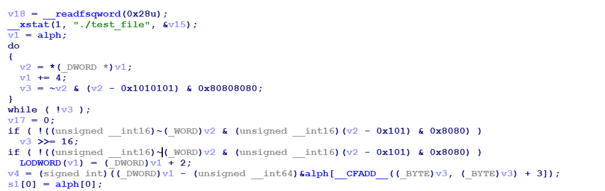
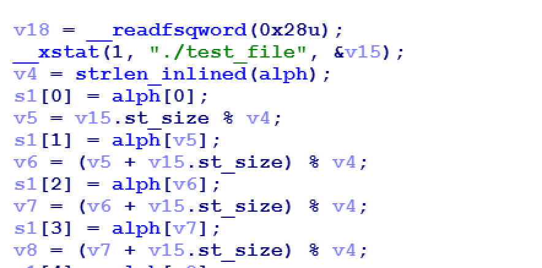

# HexRaysAST modifier

this is simple PoC for replacing ast subtree in HexRays decompiler window

### Current code contains templates for:
1.  replacing inlined strlen called on global variable
1.  auto renaming globals in expressions like global_var = func(arg1, "newglobalname")
1.  auto renaming structure fields like: *glob_str.f0 = sub_cafebabe* become *glob_str.sub_cafebabe = sub_cafebabe*

scripts are not fully tested(eq it can fail on some ctree elements) but you can already make some usefull things.

ast_helper.py contains some functions that helps creating ctree items

*If you got some interr like 50680 etc after yours changes to ctree you should check IDADIR/hexrays_sdk/verifier/cverify.cpp(you need to have IDA 7.1+)*
### Usage
1. Load **HRAST.py** into IDA
1. write your patterns in **read_patterns.py**. You should define PATTERNS list with tuples (template_code, replacement_fcn, is_chain) as elements
1. call **reLOAD()** function from IDAPython
1. reload decompiler window
1. you can call **unLOAD()** function to disable modifications
1. also **deBUG()** method switches DEBUG mode on/off
1. if you want to reload **HRAST.py** or remove hex-rays callback call **hr_remove()**

### Some example:

**Before**

**After**

